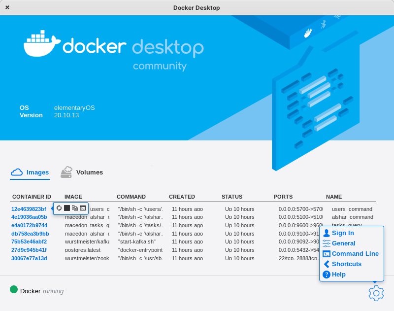
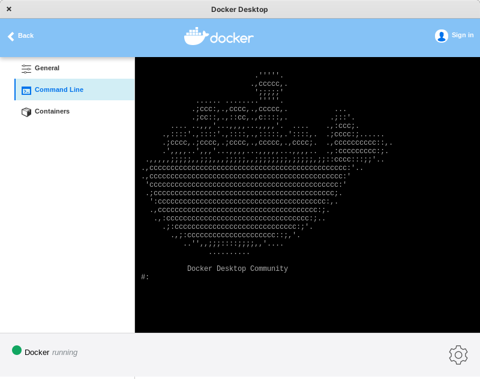
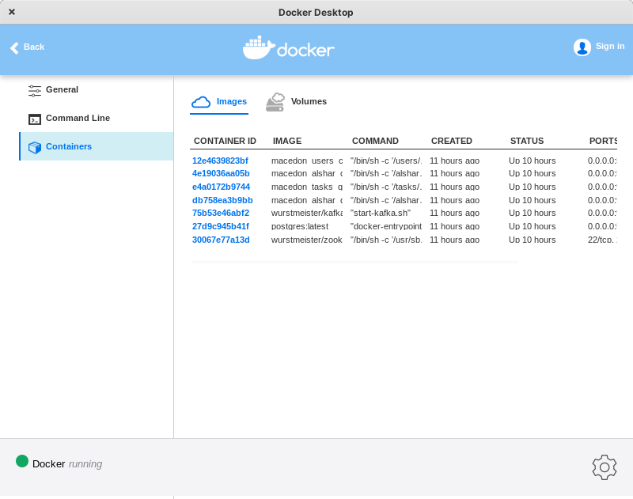

## Docker Desktop for Linux
It's graphical interface of Docker for Linux, this is not an official release from Docker , but a personal project, to build tools for the Linux Community.

### Screenshots of Docker Desktop for Linux






### Requirements
Before installing the script make sure to double check you have installed `gawk`
```shell
sudo apt install gawk
sudo dnf install gawk
sudo zypper install gawk
sudo pacman -S gawk
```

### Distros
Supported and tested Linux Distros
- Fedora 35
- Ubuntu , Elementary OS , Debian
- Manjaro - Xfc Desktop , Manjaro - Gnome Desktop
- Open Suse - Xfc Desktop, Gnome Desktop

### Installation process
Installation process is simple, download the zip of the repository and make sure to assign `chmod +x docker-desktop.sh` and run `./docker-desktop.sh install`.
The installation process will require your `sudo` password to install all dependencies.
Note: the application will be installed in `~/.docker-desktop` directory.
